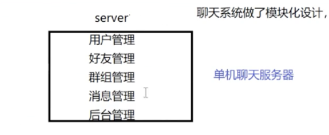
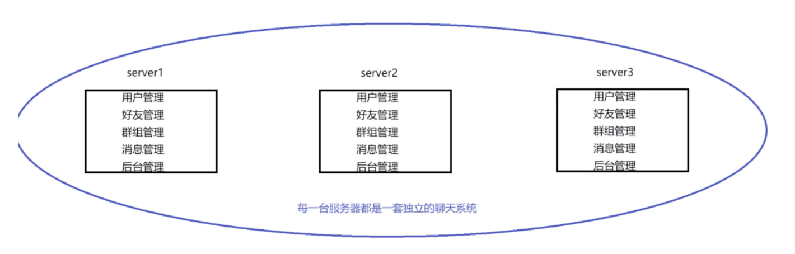
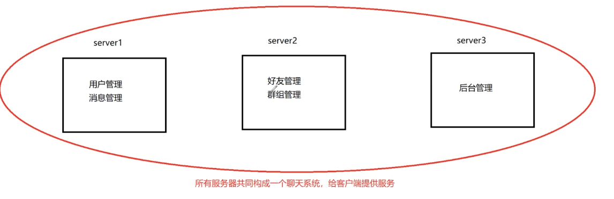
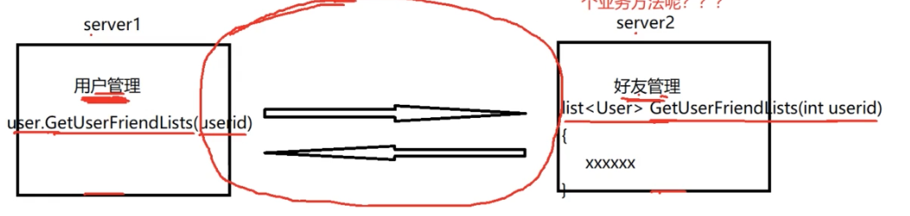
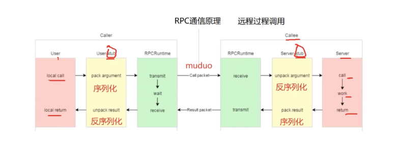
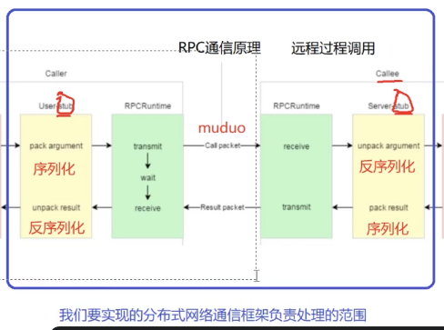
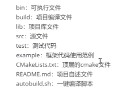
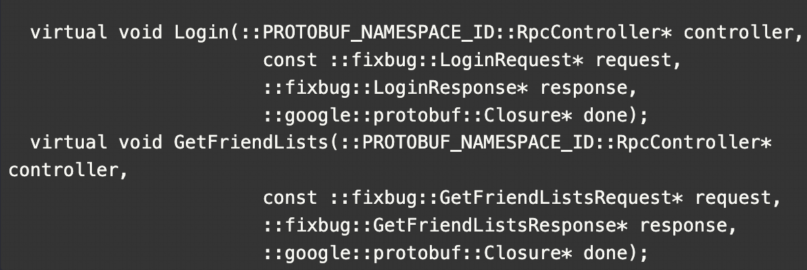
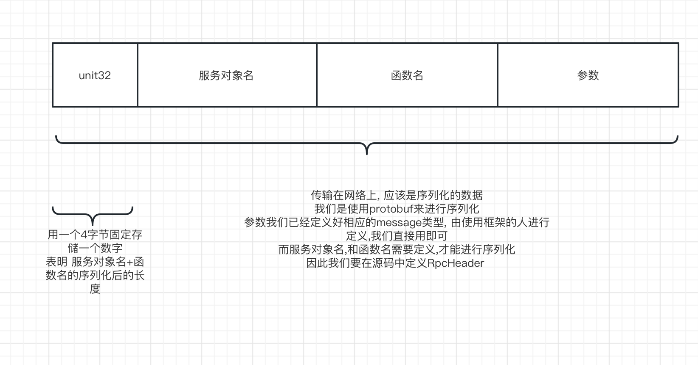

# readme

> 我的理解: 单机 硬件不够 ,并发满足不了, 还容易挂
>
> 所以扩展成集群, 集群每个服务器上都部署一套完整的系统, 硬件够了,也不容易挂了
>
> 但有点浪费,有些模块不需要部署多台上, 太费资源了 , 所以分布式 , 把系统拆分成模块 放到每台服务器上  需要高并发的模块就多放几台 容易挂的也多放几台  资源需求就蛮少

## 集群和分布式

集群:每一台服务器独立运行一个工程的所有模块

分布式:一个工程拆分了很多模块,每一个模块独立部署运行在一个服务器主机上,所有服务器协同工作共同提供服务,每一台服务器称作分布式的一个节点,根据节点的并发要求,对一个节点可以再做节点模块集群部署

## 单机聊天服务器



1. 受限于硬件资源,聊天服务器所能承受的用户的并发量
2. 挂了就完了
3. 一个bug  整个代码全部重新编译
4. 系统中,有些模块属于cpu密集型的,有些模块属于io密集型的,造成各个对于硬件需求是不一样的

## 集群聊天服务器



只解决了硬件资源, 挂了就完了这俩问题

代码需要费大力重新部署,每个模块对硬件的需求是不同的(只是水平扩展硬件) 这俩都没解决

比如后台管理模块这个模块,根本不需要高并发,没必要放到每个服务器上

> 管理员访问还需要通过负载均衡模块, 分配到服务器上,这不是 没必要嘛

## 分布式聊天服务器

把系统拆分成模块 放到每台服务器上  需要高并发的模块就多放几台 容易挂的也多放几台  资源需求就蛮少



比如消息管理 可以放置到 多个服务器上

硬件资源 解决

挂了 解决。 挂了 多放几台呗

bug重新部署 解决

io cpu需要不同 解决

根据分布式节点并发需求可以再扩展

### 从集群式 到 分布式聊天服务器 看来只有好处 ,但代价是什么?

1. 大系统的软件模块该怎么划分

   各模块可能会实现大量重复的代码,需要架构的比较好
2. 各个模块之间该怎么访问?

   各个模块都运行在不同的进程里.

   docker虚拟化环境中



### rpc 的 通信原理 remote procedure call 当成分布式通信就行

机器a如何 调用 机器 b 的函数



一个函数 发现是rpc函数 ,服务配置中心查到这个服务在哪个机器上 ,  把函数名与参数序列化发送给该机器  , 机器反序列化 执行该函数。把结果序列化 传给 原机器。 原机器序列化 得到结果

#### 将要实现 的 分布式mrpc 负责的部分



黄色部分:protobuf 序列化

绿色部分:zookeeper服务器配置中心 muduo网络库

### protobuf>=json 好处?

1. protobuf是二进制存储的;xml和json都是文本存储的
2. protobuf不需要存储额外的信息,json是怎么存储数据的呢 json是keyvalue 需要key

protocol buffer 是google的一种数据交换的格式, 它独立于平台语言

它是一种二进制的格式,比使用xml(20倍) json(10倍) 进行数据交换快许多, 可以把它分布式应用之间的数据通信或者异构环境下的数据交换 作为一种效率和兼容性都很优秀的二进制数据传输格式,可以用于网络传输,配置文件,数据存储等领域

## 项目结构

bin: 可执行文件

build:项目编译文件

lib:项目库文件

src:源代码

test:测试代码

example:框架代码使用范例

CMakeLists: 顶层的cmake文件



## 准备

安装muduo 与 protobuf 库

#### 安装muduo

1. 安装依赖:
   sudo apt-get install libbost-dev libbost-test-dev
   sudo apt-get install libcurl4-openssl-dev libc-ares-dev
2. 拷贝文件
   git clone https://github.com/chenshuo/muduo.git

## 库的使用

#### 安装

链接: https://pan.baidu.com/s/17A2_A6b1AgjZCcZ5k6YfSg 提取码: avqd
--来自百度网盘超级会员v5的分享

1. 解压压缩包: unzip protob·uf-master.zip
2. 进入解压后的文件夹: cd protobuf-master
3. 安装所需工具: sudo apt-get install autoconf automake libtool curl make g++ unzip
4. 自动生成configure配置文件 ./autogen.sh
5. 配置环境: ./configure
6. 编译源代码: make
7. 安装 sudo make install
8. 刷新动态库: sudo ldconfig

### 基本使用

proto库的测试 在 test/proto

muduo库的测试 在test/muduo

### proto库

#### protobuf 它能够将 一个对象 编码成二进制,作为传输的中间文件 ,并能够将中间文件解析回原数据创建.proto文件 ,定义好相应的数据类型

编写 xxx.proto文件

protoc test.proto --cpp_out="./"  // 生成相应的代码,包含数据类型的编码

// main.cpp 为调用proto的代码, 链接动态库进行编译

g++ test.pb.cc main.cpp -o test  `pkg-config --cflags --libs protobuf` -lpthread

#### 文件头

test.proto

```
// 指明版本及包名
syntax="proto3";// 声明proto版本

package fixbug;// 声明代码所在的包(对c++来说就是namespace)

```

#### 基本对象的定义

test.proto

string 定义成byte会更好

```

// 定义登陆请求消息类型
message LoginRequest
{
    string name=1; // 表明第一个字段
    string pwd=2; // 定义第二个字段
}
// 定义登陆响应消息类型
message LoginResponse
{
    int32 errcode=1;
    string errmsg=2;
    bool success=3;
}
```

#### 基本对象的初始化与赋值

main.cpp

```
  LoginRequest req;
    req.set_name("zhang san");
    req.set_pwd("123456");
```

#### 基本对象的编码与解码

```
  
// 编码
string send_str;
    if(req.SerializeToString(&send_str))
    {
        cout<<send_str.c_str()<<endl;
    }
// 解码
LoginRequest reqB;
    if(reqB.ParseFromString(send_str))
    {
        cout<<reqB.name()<<endl;
        cout<<reqB.pwd()<<endl;
    }
```

#### 对象中的“组合" 定义

一个对象中包含另一个对象即为组合

test.proto

```
message ResultCode
{
    int32 errcode=1;
    string errmsg=2;
}

// 定义登陆响应消息类型
message LoginResponse
{
    ResultCode result=1;
    bool success=2;
}
```

#### 对象中的"组合" 初始化与赋值

main.cpp

```
LoginResponse rsp;
    ResultCode *rc=rsp.mutable_result();
    rc->set_errcode(1);
    rc->set_errmsg("登陆处理失败");
```

#### 列表定义

```
message User
{
    bytes name;
    uint32 age=2;
    enum Sex
    {
        MAN=0;
        WOMAN=1;
    }
    Sex sex=3;
}
message GetFriendListsResponse
{
    ResultCode result=1;
    repeated User users=2;
}
```

#### 列表的初始化

test.proto

```
GetFriendListsResponse rlist;
    ResultCode* rc2=rlist.mutable_result();
    rc2->set_errcode(0);

    User *user1=rlist.add_friend_lists();
    user1->set_name("zhang san");
    user1->set_age(20);
    user1->set_sex(User::MAN);

    User *user2=rlist.add_friend_lists();
    user2->set_name("zhang san");
    user2->set_age(20);
    user2->set_sex(User::MAN);
```

#### 遍历列表

main.cpp

```
cout<<rlist.friend_lists_size()<<endl;
    for(auto item:rlist.friend_lists())
    {
        cout<<item.name()<<endl;
        cout<<item.age()<<endl;
    }

     return 0;
```

创建 XXX.proto 文件// 指明版本及包名

### rpc service

在前面protobuf中 定义了对象

接下来要在protobuf 中,定义相关的函数

#### 函数的注册

.proto

```
// 定义下列选项, 表明rpc服务定义方法需要生成
option cc_generic_services=true;

// 在proto中定义rpc方法类型  必须定义option 才能生成该代码
service UserServiceRpc 
{
    rpc Login(LoginRequest) returns(LoginResponse);
    rpc GetFriendLists(GetFriendListsRequest) 	returns(GetFriendListsResponse); 
}
```

#### 底层

#### message

```
定义一个数据对象
继承 google::protobuf::Service
提供
	setXXX() //数据初始化方法
	XXX() // 数据访问方法
	编码方法
	解码方法
```

#### service

#### callee ServiceProvider rpc 提供者 继承至google service

UserServiceRpc

具有默认构造函数,不需要传入任何参数

包含两个函数 及相应的参数  输入的参数作为一个const  输出的参数 作为一个空变量提供进去

```
class UserServiceRpc : public ::PROTOBUF_NAMESPACE_ID::Service {
 

  static const ::PROTOBUF_NAMESPACE_ID::ServiceDescriptor* descriptor();

  virtual void Login(::PROTOBUF_NAMESPACE_ID::RpcController* controller,
                       const ::fixbug::LoginRequest* request,
                       ::fixbug::LoginResponse* response,
                       ::google::protobuf::Closure* done);
  virtual void GetFriendLists(::PROTOBUF_NAMESPACE_ID::RpcController* controller,
                       const ::fixbug::GetFriendListsRequest* request,
                       ::fixbug::GetFriendListsResponse* response,
                       ::google::protobuf::Closure* done);
```

#### caller ServiceConsumer rpc 服务消费者。继承至 UserServiceRpc( 提供者类)

#### UserServiceRpc_Stub 代理类

本地调用-> stub -> 网络 -> stub -> 服务器执行函数

无默认构造函数,需要传入channel

```
class UserServiceRpc_Stub : public UserServiceRpc {
 public:
  UserServiceRpc_Stub(::PROTOBUF_NAMESPACE_ID::RpcChannel* channel);
  UserServiceRpc_Stub(::PROTOBUF_NAMESPACE_ID::RpcChannel* channel,
                   ::PROTOBUF_NAMESPACE_ID::Service::ChannelOwnership ownership);
  ~UserServiceRpc_Stub();

  inline ::PROTOBUF_NAMESPACE_ID::RpcChannel* channel() { return channel_; }

  // implements UserServiceRpc ------------------------------------------

  void Login(::PROTOBUF_NAMESPACE_ID::RpcController* controller,
                       const ::fixbug::LoginRequest* request,
                       ::fixbug::LoginResponse* response,
                       ::google::protobuf::Closure* done);
  void GetFriendLists(::PROTOBUF_NAMESPACE_ID::RpcController* controller,
                       const ::fixbug::GetFriendListsRequest* request,
                       ::fixbug::GetFriendListsResponse* response,
                       ::google::protobuf::Closure* done);
 private:
  ::PROTOBUF_NAMESPACE_ID::RpcChannel* channel_;
  bool owns_channel_;
  GOOGLE_DISALLOW_EVIL_CONSTRUCTORS(UserServiceRpc_Stub);
};
```

去看该方法实现的时候 会发现

```
void UserServiceRpc_Stub::Login(::PROTOBUF_NAMESPACE_ID::RpcController* controller,
                              const ::fixbug::LoginRequest* request,
                              ::fixbug::LoginResponse* response,
                              ::google::protobuf::Closure* done) {
  channel_->CallMethod(descriptor()->method(0),
                       controller, request, response, done);
}
void UserServiceRpc_Stub::GetFriendLists(::PROTOBUF_NAMESPACE_ID::RpcController* controller,
                              const ::fixbug::GetFriendListsRequest* request,
                              ::fixbug::GetFriendListsResponse* response,
                              ::google::protobuf::Closure* done) {
  channel_->CallMethod(descriptor()->method(1),
                       controller, request, response, done);
}
```

调用函数的时候 , 会自动 调用 channel_->CalllMethod()

我们去看下 channel 是什么类

```
class PROTOBUF_EXPORT RpcChannel {
 public:
  inline RpcChannel() {}
  virtual ~RpcChannel();

  // Call the given method of the remote service.  The signature of this
  // procedure looks the same as Service::CallMethod(), but the requirements
  // are less strict in one important way:  the request and response objects
  // need not be of any specific class as long as their descriptors are
  // method->input_type() and method->output_type().
  virtual void CallMethod(const MethodDescriptor* method,
                          RpcController* controller, const Message* request,
                          Message* response, Closure* done) = 0;

 private:
  GOOGLE_DISALLOW_EVIL_CONSTRUCTORS(RpcChannel);
};
```

会发现 channel 是一个抽象类 我们必须 继承实现该类

在方法中实现对象的序列化 及网络传输等等

method 为方法

controller

request 参数对象

response 响应对象

```
class mychannel:public RpcChannel
{
    void callmeMethod(const MethodDescriptor* method,
                          RpcController* controller, const Message* request,
                          Message* response, Closure* done)
    {

  

    }
}
```

## 本地函数注册为rpc函数(业务代码)

在example 中提供

展示了callee 如何将本地函数注册为rpc函数

#### userServiceRpc和userServiceRpc_stub的本质

使用框架的时候要明确一件事

1. 框架让我们实现什么
   ee端继承。userServiceRpc , 我们需要继承并用本地函数覆盖这两个函数
   这样就相当于本地函数注册了

   

在这个函数中,我们会得到 request 输入参数。response 返回的空对象。done 回调函数

我们需要根据函数逻辑处理参数, 并返回结果赋值给response

## 框架的设计

### 框架的使用

声明一个对象继承xxxServiceRpc,重写其中注册的方法,使用本地方法进行覆盖

调用的时候,先初始化一个rpc对象(单例模式全局可用),

声明一个网络服务对象

声明本地函数服务对象,注册到网络服务对象中, 然后启动

(很简单的使用,理想化的设计)

example/callee/ userservice.cpp

```
#include<iostream>
#include<string>
#include"user.pb.h"
/*
#include "../user.pb.h"  不需要 因为外层的cmakelist已经设定好搜寻头文件的地址
userservice 原本是一个本地服务,提供了两个进程内的本地方法,login和getfriendlists
*/
// 
class UserService:public fixbug::UserServiceRpc
{
public:
    bool Login(std::string name, std::string pwd)
    {
        std::cout<<"doing local service: Login"<<std::endl;
        std::cout<<"name: "<<name<<"pwd:"<<pwd<<std::endl;
        return true;
    }

    /*
    重写基类UserServiceRpc的虚函数,下面这些方法都是框架直接调用的

    caller->login(loginrequest)->
  
    */
    void Login(::google::protobuf::RpcController* controller,
                const ::fixbug::LoginRequest* request,
                ::fixbug::LoginResponse* response,
                ::google::protobuf::Closure* done)
    {
        // 框架给业务上爆了请求参数LoginRequest,业务获取相应数据做本地业务
        std::string name=request->name();
        std::string pwd=request->pwd();
        // 做本地业务
        bool login_result=Login(name,pwd);
        // 把响应写入
        fixbug::ResultCode * code=response->mutable_result();
        code->set_errcode(0);
        code->set_errmsg("");
        response->set_success(login_result);
        // 执行回调操作 执行响应对象数据的序列化和网络发送（都是由框架来完成的)
        done->Run();

    }


};
int main(int argc,char **argv)
{
    // 调用框架的初始化操作
    MrpcApplication::Init(argc,argv);

    // 把UserService对象发布到rpc节点上
    RpcProvider provider; // 网络发布对象 
    provider.NotifyService(new UserService());
    provider.NotifyService(new ProductService());

    //启动rpc
    provider.run()

    return 0;
}
```

### 框架的头文件

src/include/

MrpcApplication.h 单例模式 全局获取初始化后的rpc对象

RpcProvider.h rpc网络服务提供类 相当于注册函数 跑起来

### RpcProvider存储服务对象

> 服务对象指的是一个类的实例
>
> callee 实现一个类 其中包含本地方法, 在protobuf注册一个Service,并填写希望注册的rpc函数后, 会自动生成同名的Service类,其中包含rpc虚函数的序列化参数返回形式 , 我们继承后,实现该虚函数即可(从序列化参数中取出相应数据, 调用本地方法, 把响应放入序列化参数中 , 调用回调函数)

在callee注册rpc服务的过程中,需要把服务对象注册到RpcProvider中

> RpcProvider负责参数与返回值的序列化,网络发送,存储服务对象及相应的方法

```
 // 把UserService对象发布到rpc节点上
    RpcProvider provider; // 网络发布对象 
    provider.NotifyService(new UserService());

```

**RpcProvider需要存储服务对象及相应的rpc函数**, 这样网络传过来,我们才能知道调用哪个对象的哪个函数

因此 会建立一个映射

map<服务名, 服务信息>

struct 服务信息

{

服务指针

map `<函数名,函数描述符>`

}

### RpcProvider网络解析字符流

src/RpcProvider.cpp onmessage

字符流的定义



因此RpcProvider 接受到相应的字节流, 进行解析, 并调用相应的函数即可

### RpcProvider调用相关的函数,并发送序列化的response

> src/RpcProvider.cpp callmeback

根据service的callmethod,可以调用相关的函数

需要 填入 request和 response 及 (不包含任何参数的)回调对象

回调函数需要继承closure并实现 其中的run方法

NewCallback能绑定相关的参数数据,并生成一个回调对象
