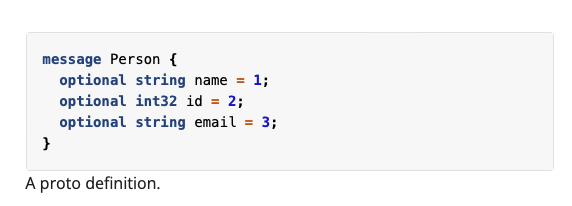
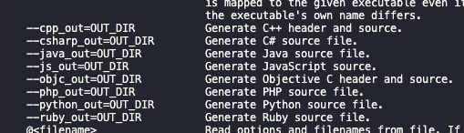
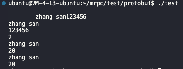
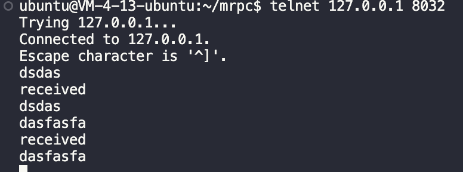

# 一文讲解 基于C++手写Rpc项目

[toc]

# github

> 请一定结合代码看博客

https://github.com/stolendance/mrpc

# 预备知识

## 集群和分布式

> 我的理解: 系统部署到一台单机上,会存在问题:硬件不够, 并发满足不了, 还容易挂
>
> 所以扩展成集群, 集群每个服务器上都部署一套完整的系统, 硬件够了,也不容易挂了
>
> 但该方式较为浪费,有些模块不需要部署多台上, 太费资源了, 所以分布式 , 把系统拆分成模块 放到每台服务器上  需要高并发的模块就多放几台 容易挂的也多放几台  资源需求就蛮少 当然这样系统的复杂性大幅度提高

集群:每一台服务器独立运行一个工程的所有模块

分布式:一个工程拆分了很多模块,每一个模块独立部署运行在一个服务器主机上,所有服务器协同工作共同提供服务,每一台服务器称作分布式的一个节点,根据节点的并发要求,对一个节点可以再做节点模块集群部署

### 单机聊天服务器


1. 受限于硬件资源,聊天服务器所能承受的用户的并发量
2. 硬件挂了即整个系统将崩溃
3. 一个bug  整个代码全部重新编译
4. 系统中,有些模块属于cpu密集型的,有些模块属于io密集型的,造成各个对于硬件需求是不一样的

### 集群聊天服务器


只解决了硬件资源, 挂了就完了这俩问题

代码需要费大力重新部署,每个模块对硬件的需求是不同的(只是水平扩展硬件) 这俩都没解决

比如后台管理模块这个模块,根本不需要高并发,没必要放到每个服务器上

> 访问需要通过负载均衡模块, 将需求分配到服务器上

### 分布式聊天服务器

把系统拆分成模块 放到每台服务器上  需要高并发的模块就多放几台 容易挂的也多放几台  资源需求就蛮少


比如消息管理 可以放置到 多个服务器上

硬件资源 解决

挂了 解决。 挂了 多放几台呗

bug重新部署 解决

io cpu需要不同 解决

根据分布式节点并发需求可以再扩展

### 从集群式 到 分布式聊天服务器 看来只有好处 ,但代价是什么?

==系统复杂性大大增加== , 或者说对基础架构要求很高

1. 大系统的软件模块该怎么划分

   各模块可能会实现大量重复的代码,需要架构的比较好
2. 各个模块之间该怎么访问?

   各个模块都运行在不同的进程里.

   docker虚拟化环境中


## rpc 的 通信原理 remote procedure call 分布式通信

机器a如何 调用 机器 b 的函数


一个函数 发现是rpc函数 ,服务配置中心查到这个服务在哪个机器上 ,  把函数名与参数序列化发送给该机器  , 机器反序列化 执行该函数。把结果序列化 传给 原机器。 原机器序列化 得到结果

## 手写的rpc部分


黄色部分:protobuf 序列化

绿色部分:zookeeper服务器配置中心 muduo网络库

## protobuf>=json 好处?

1. protobuf是二进制存储的;xml和json都是文本存储的
2. protobuf不需要存储额外的信息,json是怎么存储数据的呢 json是keyvalue 需要key

protocol buffer 是google的一种数据交换的格式, 它独立于平台语言

它是一种二进制的格式,比使用xml(20倍) json(10倍) 进行数据交换快许多, 可以把它分布式应用之间的数据通信或者异构环境下的数据交换 作为一种效率和兼容性都很优秀的二进制数据传输格式,可以用于网络传输,配置文件,数据存储等领域

# 介绍protobuf

protocol Buffers are language-neutral, platform-neutral extensible mechanism for seializing structured data

Protobuf 这是一种序列化数据的协议 从我理解, 这更是一种 通信协议 ,定义了如何交换数据, 数据包含哪些等等. 它很厉害的地方在于 语言中立 ,大部分语言都支持,支持两边语言不同也能 , 平台中立, 支持跨平台

这非常厉害 , 它同时采用二进制的方式对数据进行传输 相较于json数据小了很多

那我们从各个方面对比下 json 与 protobuf 吧

## protobuf 与 json

### 二者基本使用方式

json本质就是一种规定好格式的字符串, 不需要任何代码定义的支持,  它默认采用键值对的方式

来划分数据


protobuf 双方首先使用同一份 .proto 文件

> 是的,在传输之前,二者需要进行商量好 传什么内容, 这样protobuf在传输过程中就不需要传输键值, 能很大地节省数据量
>
> json不需要要商量好, 因此常用作接口, 来向任何可能调用接口的人表明数据的内容
>
> 而protobuf 用作服务器之间的通讯

在 .proto 文件中 定义了 需要传输的对象(message)



> 接下来讲解 protobuf 如何达到 语言中立 平台中立

定义好.proto文件后, 通过protoc 可以使用.proto 根据需要生成不同的代码依赖



比如C++,会生成 .pb.cc  .pb.h 其中代码包含了对象的定义及对象的序列化 与 解序列化 等相关函数

通过发送方与接收方都引入.proto生成的代码

发送方就可以做到定义数据并序列化

接受方就可以做到反序列化并取出数据

> protobuf就是这样做到语言中立 , 平台中立的 , 太解耦了! 牛!

## .proto的基本定义

讲解基本的代码定义, 如有更深层次的需要 , 可以  查看文档 与 阅读源码

```
syntax="proto3";// 声明proto版本

package fixbug;// 声明代码所在的包(对c++来说就是namespace)


```

定义一个对象(消息 message)

```
message ResultCode
{
    int32 errcode=1;
    bytes errmsg=2; // 1 ,2 代表第一个参数, 第二个参数 是占位符
}
```

还可以组合

```
message GetFriendListsResponse
{
    ResultCode result=1;
    repeated User friend_lists=2;
}
```

## protobuf的基本代码

```c++
#include<iostream>
#include<string>
#include "test.pb.h"
using namespace fixbug;
using namespace std; // 引入

// 定义对象
// 封装了login请求对象的数据
LoginRequest req;
req.set_name("zhang san");
req.set_pwd("123456");

// 序列化
// 对象数据序列化-》char*
string send_str;
if(req.SerializeToString(&send_str))
{
cout<<send_str.c_str()<<endl;
}

// 反序列化
// 从send_str 反序列化一个login请求对象

LoginRequest reqB;
if(reqB.ParseFromString(send_str))
{
	cout<<reqB.name()<<endl;
	cout<<reqB.pwd()<<endl;
}


```

### protobuf 它能够将 一个对象 编码成二进制,作为传输的中间文件 ,并能够将中间文件解析回原数据创建.proto文件 ,定义好相应的数据类型

编写 xxx.proto文件

protoc test.proto --cpp_out="./"  // 生成相应的代码,包含数据类型的编码

// main.cpp 为调用proto的代码, 链接动态库进行编译

g++ test.pb.cc main.cpp -o test  `pkg-config --cflags --libs protobuf` -lpthread

### 文件头

test.proto

```
// 指明版本及包名
syntax="proto3";// 声明proto版本

package fixbug;// 声明代码所在的包(对c++来说就是namespace)

```

### 基本对象的定义

test.proto

string 定义成byte会更好

```
// 定义登陆请求消息类型
message LoginRequest
{
    string name=1; // 表明第一个字段
    string pwd=2; // 定义第二个字段
}
// 定义登陆响应消息类型
message LoginResponse
{
    int32 errcode=1;
    string errmsg=2;
    bool success=3;
}
```

### 基本对象的初始化与赋值

main.cpp

```
LoginRequest req;
req.set_name("zhang san");
req.set_pwd("123456");
```

### 基本对象的编码与解码

```
  
// 编码
string send_str;
    if(req.SerializeToString(&send_str))
    {
        cout<<send_str.c_str()<<endl;
    }
// 解码
LoginRequest reqB;
    if(reqB.ParseFromString(send_str))
    {
        cout<<reqB.name()<<endl;
        cout<<reqB.pwd()<<endl;
    }
```

### 对象中的“组合" 定义

一个对象中包含另一个对象即为组合

test.proto

```
message ResultCode
{
    int32 errcode=1;
    string errmsg=2;
}

// 定义登陆响应消息类型
message LoginResponse
{
    ResultCode result=1;
    bool success=2;
}
```

### 对象中的"组合" 初始化与赋值

main.cpp

```
LoginResponse rsp;
    ResultCode *rc=rsp.mutable_result();
    rc->set_errcode(1);
    rc->set_errmsg("登陆处理失败");
```

### 列表定义

```
message User
{
    bytes name;
    uint32 age=2;
    enum Sex
    {
        MAN=0;
        WOMAN=1;
    }
    Sex sex=3;
}
message GetFriendListsResponse
{
    ResultCode result=1;
    repeated User users=2;
}
```

### 列表的初始化

test.proto

```
GetFriendListsResponse rlist;
ResultCode* rc2=rlist.mutable_result();
rc2->set_errcode(0);

User *user1=rlist.add_friend_lists();
user1->set_name("zhang san");
user1->set_age(20);
user1->set_sex(User::MAN);

User *user2=rlist.add_friend_lists();
user2->set_name("zhang san");
user2->set_age(20);
user2->set_sex(User::MAN);
```

### 遍历列表

main.cpp

```
cout<<rlist.friend_lists_size()<<endl;
    for(auto item:rlist.friend_lists())
    {
        cout<<item.name()<<endl;
        cout<<item.age()<<endl;
    }

     return 0;
```

创建 XXX.proto 文件// 指明版本及包名

### rpc service

在前面protobuf中 定义了对象

接下来要在protobuf 中,定义相关的函数

### 函数的注册

.proto

```
// 定义下列选项, 表明rpc服务定义方法需要生成
option cc_generic_services=true;

// 在proto中定义rpc方法类型  必须定义option 才能生成该代码
service UserServiceRpc 
{
    rpc Login(LoginRequest) returns(LoginResponse);
    rpc GetFriendLists(GetFriendListsRequest) 	returns(GetFriendListsResponse); 
}
```

# 项目结构

bin: 可执行文件

build:项目编译文件

lib:项目库文件

src:源代码

test:测试代码

example:框架代码使用范例

CMakeLists: 顶层的cmake文件

readme: 说明文档

# 项目准备

安装muduo 与 protobuf 库

## 安装muduo

1. 安装依赖:
   sudo apt-get install libbost-dev libbost-test-dev
   sudo apt-get install libcurl4-openssl-dev libc-ares-dev
2. 拷贝文件
   git clone https://github.com/chenshuo/muduo.git
3. ./build.sh

## 安装protobuf

链接: https://pan.baidu.com/s/17A2_A6b1AgjZCcZ5k6YfSg 提取码: avqd
--来自百度网盘超级会员v5的分享

1. 解压压缩包: unzip protob·uf-master.zip
2. 进入解压后的文件夹: cd protobuf-master
3. 安装所需工具: sudo apt-get install autoconf automake libtool curl make g++ unzip
4. 自动生成configure配置文件 ./autogen.sh
5. 配置环境: ./configure
6. 编译源代码: make
7. 安装 sudo make install
8. 刷新动态库: sudo ldconfig

## 库的测试与使用

### proto库的测试 在 test/proto

定义test.proto

使用protobuf 处理 test.proto 生成test.pb.c、test.proto

```
protoc test.proto --cpp_out="./"  // 生成相应的代码,包含数据类型的编码
```

在main.cpp测试了protobuf的功能

编译main.cpp

```
g++ test.pb.cc main.cpp -o test  `pkg-config --cflags --libs protobuf` -lpthread
```

执行可执行文件

```
./test
```



可以看到 成功对定义的对象进行赋值,序列化, 反序列化, 取值

### muduo库的测试 在test/muduo

muduo_test.cpp 实现了一个简单的echo server

编译:

```
g++ -std=c++11 muduo_test.cpp -lmuduo_net -lmuduo_base -lpthread -o muduo_test
```

执行:

一个shell中执行

```
./muduo_test 
```

另一个shell中执行

```
telnet 127.0.0.1 8032
```



echo server 正常

# protobuf 我的理解及源码分析

1. protobuf 实际上是一个通讯协议 两边通过使用同一份.proto文件可以定义 对象、函数、服务
2. protobuf通过针对不同语言基于.proto文件生成依赖代码 达到跨平台, 语言中立的效果
3. protobuf基础库分为三大层: service、method、message、 这三个是protobuf的基类

service 代表 一个服务

### service.h

我们可以看到service基类,  有几个函数

GetDescriptor() 获得service描述符 可以获得service相关的属性

callmethod() 调用service下的method

getrequestPrototype() 根据message描述符 得到参数的message

getresponseprototype() 根据message描述符 得到响应的message

```
class PROTOBUF_EXPORT Service {
 public:
  inline Service() {}
  virtual ~Service();

  enum ChannelOwnership { STUB_OWNS_CHANNEL, STUB_DOESNT_OWN_CHANNEL };
	virtual const ServiceDescriptor* GetDescriptor() = 0;
	virtual void CallMethod(const MethodDescriptor* method,
                          RpcController* controller, const Message* request,
                          Message* response, Closure* done) = 0;
  virtual const Message& GetRequestPrototype(
      const MethodDescriptor* method) const = 0;
  virtual const Message& GetResponsePrototype(
      const MethodDescriptor* method) const = 0;

 private:
  GOOGLE_DISALLOW_EVIL_CONSTRUCTORS(Service);
};
```

method 代表 一个方法

message 代表 一个对象 , 通常把函数的参数包装成一个对象、函数的返回值包装成一个对象

protobuf生成的依赖代码(.user.pb.h user.pb.cc) 主要包含用户自定义的 service、method、message具体子类

他们从service、method、message继承而来

### servicedescriptor

可以看出主要获得service相关的属性

可以得到service的name、full_name、methoddescriptor、method的数目...

```
// Describes an RPC service. Use DescriptorPool to construct your own
// descriptors.
class PROTOBUF_EXPORT ServiceDescriptor {
 public:
  typedef ServiceDescriptorProto Proto;

  // The name of the service, not including its containing scope.
  const std::string& name() const;
  // The fully-qualified name of the service, scope delimited by periods.
  const std::string& full_name() const;
  // Index of this service within the file's services array.
  int index() const;

  // The .proto file in which this service was defined.  Never nullptr.
  const FileDescriptor* file() const;

  // Get options for this service type.  These are specified in the .proto file
  // by placing lines like "option foo = 1234;" in the service definition.
  // Allowed options are defined by ServiceOptions in descriptor.proto, and any
  // available extensions of that message.
  const ServiceOptions& options() const;

  // The number of methods this service defines.
  int method_count() const;
  // Gets a MethodDescriptor by index, where 0 <= index < method_count().
  // These are returned in the order they were defined in the .proto file.
  const MethodDescriptor* method(int index) const;

  // Look up a MethodDescriptor by name.
  const MethodDescriptor* FindMethodByName(const std::string& name) const;
  // See Descriptor::CopyTo().
  void CopyTo(ServiceDescriptorProto* proto) const;

  // See Descriptor::DebugString().
  std::string DebugString() const;

  // See Descriptor::DebugStringWithOptions().
  std::string DebugStringWithOptions(const DebugStringOptions& options) const;

  // Source Location ---------------------------------------------------

  // Updates |*out_location| to the source location of the complete
  // extent of this service declaration.  Returns false and leaves
  // |*out_location| unchanged iff location information was not available.
  bool GetSourceLocation(SourceLocation* out_location) const;

 private:
  typedef ServiceOptions OptionsType;

  // Allows access to GetLocationPath for annotations.
  friend class io::Printer;
  friend class compiler::cpp::Formatter;

  // See Descriptor::DebugString().
  void DebugString(std::string* contents,
                   const DebugStringOptions& options) const;

  // Walks up the descriptor tree to generate the source location path
  // to this descriptor from the file root.
  void GetLocationPath(std::vector<int>* output) const;

  const std::string* name_;
  const std::string* full_name_;
  const FileDescriptor* file_;
  const ServiceOptions* options_;
  MethodDescriptor* methods_;
  int method_count_;
  // IMPORTANT:  If you add a new field, make sure to search for all instances
  // of Allocate<ServiceDescriptor>() and AllocateArray<ServiceDescriptor>() in
  // descriptor.cc and update them to initialize the field.

  // Must be constructed using DescriptorPool.
  ServiceDescriptor() {}
  friend class DescriptorBuilder;
  friend class FileDescriptor;
  friend class MethodDescriptor;
  GOOGLE_DISALLOW_EVIL_CONSTRUCTORS(ServiceDescriptor);
};

```

### method -> methoddescriptor

是的, 不存在method基类、存在的是methoddescriptor

可以看到 可以得到method的name、full_name、index、file、servicedescriptor ....

不能通过methoddescriptor调用, 只能通过service进行method调用

```
class PROTOBUF_EXPORT MethodDescriptor {
 public:
  typedef MethodDescriptorProto Proto;

  // Name of this method, not including containing scope.
  const std::string& name() const;
  // The fully-qualified name of the method, scope delimited by periods.
  const std::string& full_name() const;
  // Index within the service's Descriptor.
  int index() const;

  // The .proto file in which this method was defined.  Never nullptr.
  const FileDescriptor* file() const;
  // Gets the service to which this method belongs.  Never nullptr.
  const ServiceDescriptor* service() const;

  // Gets the type of protocol message which this method accepts as input.
  const Descriptor* input_type() const;
  // Gets the type of protocol message which this message produces as output.
  const Descriptor* output_type() const;

  // Gets whether the client streams multiple requests.
  bool client_streaming() const;
  // Gets whether the server streams multiple responses.
  bool server_streaming() const;

  // Get options for this method.  These are specified in the .proto file by
  // placing lines like "option foo = 1234;" in curly-braces after a method
  // declaration.  Allowed options are defined by MethodOptions in
  // descriptor.proto, and any available extensions of that message.
  const MethodOptions& options() const;

  // See Descriptor::CopyTo().
  void CopyTo(MethodDescriptorProto* proto) const;

  // See Descriptor::DebugString().
  std::string DebugString() const;

  // See Descriptor::DebugStringWithOptions().
  std::string DebugStringWithOptions(const DebugStringOptions& options) const;

  // Source Location ---------------------------------------------------

  // Updates |*out_location| to the source location of the complete
  // extent of this method declaration.  Returns false and leaves
  // |*out_location| unchanged iff location information was not available.
  bool GetSourceLocation(SourceLocation* out_location) const;

 private:
  typedef MethodOptions OptionsType;

  // Allows access to GetLocationPath for annotations.
  friend class io::Printer;
  friend class compiler::cpp::Formatter;

  // See Descriptor::DebugString().
  void DebugString(int depth, std::string* contents,
                   const DebugStringOptions& options) const;

  // Walks up the descriptor tree to generate the source location path
  // to this descriptor from the file root.
  void GetLocationPath(std::vector<int>* output) const;

  const std::string* name_;
  const std::string* full_name_;
  const ServiceDescriptor* service_;
  mutable internal::LazyDescriptor input_type_;
  mutable internal::LazyDescriptor output_type_;
  const MethodOptions* options_;
  bool client_streaming_;
  bool server_streaming_;
  // IMPORTANT:  If you add a new field, make sure to search for all instances
  // of Allocate<MethodDescriptor>() and AllocateArray<MethodDescriptor>() in
  // descriptor.cc and update them to initialize the field.

  // Must be constructed using DescriptorPool.
  MethodDescriptor() {}
  friend class DescriptorBuilder;
  friend class ServiceDescriptor;
  GOOGLE_DISALLOW_EVIL_CONSTRUCTORS(MethodDescriptor);
};

```

### message

```
class PROTOBUF_EXPORT Message : public MessageLite {
 public:
  inline Message() {}
  ~Message() override {}

  // Basic Operations ------------------------------------------------

  // Construct a new instance of the same type.  Ownership is passed to the
  // caller.  (This is also defined in MessageLite, but is defined again here
  // for return-type covariance.)
  Message* New() const override = 0;

  // Construct a new instance on the arena. Ownership is passed to the caller
  // if arena is a nullptr. Default implementation allows for API compatibility
  // during the Arena transition.
  Message* New(Arena* arena) const override {
    Message* message = New();
    if (arena != nullptr) {
      arena->Own(message);
    }
    return message;
  }
```

### UserServiceRpc 依赖代码的具体service类

可以看到 其继承service基类  虚函数包含 定义的函数、 需要我们继承该类, 把函数实现了. 即声明该服务(完成服务的定义)

```
class UserServiceRpc : public ::PROTOBUF_NAMESPACE_ID::Service {
 protected:
  // This class should be treated as an abstract interface.
  inline UserServiceRpc() {};
 public:
  virtual ~UserServiceRpc();

  typedef UserServiceRpc_Stub Stub;

  static const ::PROTOBUF_NAMESPACE_ID::ServiceDescriptor* descriptor();

  virtual void Login(::PROTOBUF_NAMESPACE_ID::RpcController* controller,
                       const ::fixbug::LoginRequest* request,
                       ::fixbug::LoginResponse* response,
                       ::google::protobuf::Closure* done);
  virtual void Hello(::PROTOBUF_NAMESPACE_ID::RpcController* controller,
                       const ::fixbug::HelloRequest* request,
                       ::fixbug::HelloReponse* response,
                       ::google::protobuf::Closure* done);

  // implements Service ----------------------------------------------

  const ::PROTOBUF_NAMESPACE_ID::ServiceDescriptor* GetDescriptor();
  void CallMethod(const ::PROTOBUF_NAMESPACE_ID::MethodDescriptor* method,
                  ::PROTOBUF_NAMESPACE_ID::RpcController* controller,
                  const ::PROTOBUF_NAMESPACE_ID::Message* request,
                  ::PROTOBUF_NAMESPACE_ID::Message* response,
                  ::google::protobuf::Closure* done);
  const ::PROTOBUF_NAMESPACE_ID::Message& GetRequestPrototype(
    const ::PROTOBUF_NAMESPACE_ID::MethodDescriptor* method) const;
  const ::PROTOBUF_NAMESPACE_ID::Message& GetResponsePrototype(
    const ::PROTOBUF_NAMESPACE_ID::MethodDescriptor* method) const;

 private:
  GOOGLE_DISALLOW_EVIL_CONSTRUCTORS(UserServiceRpc);
};
```

### UserServiceRpcStub 依赖代码的具体servicestub类

UserServiceRpcStub继承自UserviceRpc

它对servicestub中定义的虚函数 Login Hello进行了具体实现

将它们具体使用RpcChannel的callmethod, 汇聚到了统一调用相同的函数上

没错, 这是为caller实现的一个基础类 ,我们通过继承RpcChannel 实现新的callmethod, 能够统一实现发送服务名,函数名,参数的能力

```c++
class UserServiceRpc_Stub : public UserServiceRpc {
 public:
  UserServiceRpc_Stub(::PROTOBUF_NAMESPACE_ID::RpcChannel* channel);
  UserServiceRpc_Stub(::PROTOBUF_NAMESPACE_ID::RpcChannel* channel,
                   ::PROTOBUF_NAMESPACE_ID::Service::ChannelOwnership ownership);
  ~UserServiceRpc_Stub();

  inline ::PROTOBUF_NAMESPACE_ID::RpcChannel* channel() { return channel_; }

  // implements UserServiceRpc ------------------------------------------

  void Login(::PROTOBUF_NAMESPACE_ID::RpcController* controller,
                       const ::fixbug::LoginRequest* request,
                       ::fixbug::LoginResponse* response,
                       ::google::protobuf::Closure* done);
  void Hello(::PROTOBUF_NAMESPACE_ID::RpcController* controller,
                       const ::fixbug::HelloRequest* request,
                       ::fixbug::HelloReponse* response,
                       ::google::protobuf::Closure* done);
 private:
  ::PROTOBUF_NAMESPACE_ID::RpcChannel* channel_;
  bool owns_channel_;
  GOOGLE_DISALLOW_EVIL_CONSTRUCTORS(UserServiceRpc_Stub);
};
```

### 以Resultcode为例  依赖代码的具体message类

不具体介绍, 在protobuf示例代码中展示如何使用,核心思想是封装定义好的message 并且提供构造函数和设置初始化值相关函数 提供序列化和反序列化

# 项目深剖 以login函数为例

> tips:试着把整体逻辑用最简单的方式进行讲解:
>
> 从==callee方(函数提供方)==出发
>
> 我们首先定义proto文件,在其中定义message对象、service对象 . 对于service对象,我们需要继承, 实现其中定义的虚函数(完成service对象的定义)  , 此时我们就完成了 “服务类” 的定义
>
> 然后需要对服务类初始化, 并且以哈希的方式“存储”(这样根据rpc服务名和函数名 可以快速进行调用)
>
> 启动rpc服务后, 将所有服务与函数注册至zookeeper

> 使用muduo 做一个echo server , 接受序列化后的服务名 及函数名 和 参数
>
> 解序列化后 进行调用, 并且通过回调函数发送函数执行完后的结果

> 从==caller方(函数调用方)==出发
>
> 定义proto文件后, 依赖代码中同时形成了service_stub对象, 其继承了service对象, 并且收束至调用 传入的rpcchannel对象的callmethod方法, 因此我们可以继承rpcchannel对象 ,并重写其中的callmethod方法, 使其先访问zookeeper ,找到服务器的ip地址与端口号, 发送服务名及 函数名 和 参数 , 从而调用远程函数, 得到结果后, 解析即可

将以 下面的线进行深剖

配置类外层->配置类底层

callee-> 如何注册一个rpc函数-> 底层

caller-> 如何调用一个rpc函数->底层

异步日志

## 框架外层-配置类

配置类的目的是 为了, ==从磁盘的文件中,读取信息到内存中, 使得程序可以随时从内存中取信息, 不用随时去磁盘读==

src/include/MrpcApplication.h            src/MrpcApplication.cpp

使用单例模式, 内存中读一份就ok了,使用的是饿汉模式

在本项目中

callee方

配置类,需要定义

rpc节点的ip地址

rpc节点的端口号地址

zookeeper的ip地址

zookeeper的port地址

相当于 ==需要把服务方提供方的ip地址与端口号 注册到zookeeper中==

caller方

配置类,需要定义

zookeeper的ip地址

zookeeper的port地址

相当于 ==服务调用方访问zookeeper得到rpc服务节点的ip地址及端口号, 因此不需要在文件中写明==

> 项目中,层层开发, 最后加上zookeeper , 省事,两者读了一个 test.conf
>
> 但要明确,服务调用方 最后版本中, 并没有访问rpc的ip和port

### 配置文件

```
# rpc节点的地址
rpcserverip=127.0.0.1
#rpc节点的port端口号
rpcserverport=8088
#zk的ip地址
zookeeperip=127.0.0.1


#zk的port地址
    zookeeperport=2181
```

### 配置类的初始化

```
MrpcApplication::Init(argc,argv);
```

### 配置类的头文件及cpp

src/include/MrpcApplication.h

要点: 采用单例模式 , 把构造相关的函数都给delete掉, 默认构造函数只能设置成private, 因为要在成员方法中用

```
#pragma once
#include"MrpcConfig.h"
// mrpc 框架的初始化类
// 框架只需要一个 因此用单例模式进行设计

class MrpcApplication
{
public:
    static void Init(int argc, char ** argv);
    static MrpcApplication& GetInstance();
    static MrpcConfig& getConfig();
private:
    static MrpcConfig m_config;
    MrpcApplication(){};
    MrpcApplication(const MrpcApplication & other)=delete;
    MrpcApplication(MrpcApplication && other)=delete;
    MrpcApplication& operator =(const MrpcApplication& other)=delete;

};
```

src/MrpcApplication.cpp

要点:

1. 可执行文件的参数要求,在运行时必须指明配置文件 即必须要有-i选项 且提供配置文件
2. 使用单例模式 饿汉模式 线程安全  在局部函数中申请静态变量, 延长其生命周期 .同时C++11 编译器能保证初始化静态局部变量的线程安全性

```
#include<iostream>
#include<unistd.h>
#include "MrpcApplication.h"
MrpcConfig MrpcApplication::m_config;
void ShowArgsHelp()
{
    std::cout<<"format: command -i <configfile>" <<std::endl;
}
void MrpcApplication::Init(int argc, char ** argv)
{
    if(argc<2)
    {
        //未传入任何参数,错误
        ShowArgsHelp();
        exit(EXIT_FAILURE);
    }
    int c=0;
    std::string config_file;
    while((c=getopt(argc,argv,"i:")) !=-1)
    {
        switch(c)
        {
            case 'i':
                config_file=optarg;
                break;
            case '?':
                std::cout<<"invalid args!"<<std::endl;
                ShowArgsHelp();
                exit(EXIT_FAILURE);
            case ':':
                std::cout<<"need <configfile>" <<std::endl;
                ShowArgsHelp();
                exit(EXIT_FAILURE);
            default:
                break;
        }
    }
    // 开始加载配置文件  rpcserver_ip= rpcserver_port= zookeeper_ip= zookeeper_port=
    m_config.LoadConfigFile(config_file.c_str());
    std::cout<<"rpcserverip"<<":"<<m_config.Load("rpcserverip")<<std::endl;
    std::cout<<"rpcserverport"<<":"<<m_config.Load("rpcserverport")<<std::endl;
    std::cout<<"zookeeperip"<<":"<<m_config.Load("zookeeperip")<<std::endl;
    std::cout<<"zookeeperport"<<":"<<m_config.Load("zookeeperport")<<std::endl;

}
MrpcApplication& MrpcApplication::GetInstance()
{
    static MrpcApplication app;
    return app;
}
MrpcConfig&  MrpcApplication::getConfig()
{
    return m_config;
}
```

## 框架外层--如何注册一个rpc函数

### 定义.proto文件

在example/userservice.cpp中

定义服务, 其中的rpc函数 、rpc函数参数、 rpc函数返回值

```c++
syntax="proto3";
package fixbug;
option cc_generic_services = true;
message ResultCode
{
    int32 errcode=1;
    bytes errmsg=2;
}
message LoginRequest
{
    bytes name=1;
    bytes pwd=2;
}
message LoginResponse
{
    ResultCode result=1;
    bool success=2;
}

service UserServiceRpc
{
    rpc Login(LoginRequest) returns(LoginResponse);
}
```

### 编译.proto文件, 生成相应的依赖代码

```
protoc user.proto -cpp_out=="./"
```

会生成user.pb.h, user.pb.c , 依赖代码会生成具体的service、具体的message、具体的method 相关依赖代码

(是 service message method 结合 .proto所定义的子类)

### 声明一个服务

1. 在.proto文件中定义函数、函数的参数、函数的返回值,根据 .proto 生成 相关代码依赖文件
2. 继承protobuf依赖代码中生成的Rpc函数类
3. 通过调用本地方法实现其中的虚函数

```
class UserService:public fixbug::UserServiceRpc
{
public:
    void Hello(::google::protobuf::RpcController* controller,
                       const ::fixbug::HelloRequest* request,
                       ::fixbug::HelloReponse* response,
                       ::google::protobuf::Closure* done)
    {
        std::string name=request->name();
        std::string rs=HelloQ(name);
        response->set_hello(rs);
        done->Run();
    }

    bool Login(std::string name, std::string pwd)
    {
        std::cout<<"doing local service: Login"<<std::endl;
        std::cout<<"name: "<<name<<"pwd:"<<pwd<<std::endl;
        return true;
    }

    /*
    重写基类UserServiceRpc的虚函数,下面这些方法都是框架直接调用的

    caller->login(loginrequest)->
  
    */
    void Login(::google::protobuf::RpcController* controller,
                const ::fixbug::LoginRequest* request,
                ::fixbug::LoginResponse* response,
                ::google::protobuf::Closure* done)
    {
        // 框架给业务上爆了请求参数LoginRequest,业务获取相应数据做本地业务
        std::string name=request->name();
        std::string pwd=request->pwd();

        std::cout<<"rpc_login name: "<<name<<std::endl;
        std::cout<<"rpc_login pwd: "<<pwd<<std::endl;
        // 做本地业务
        bool login_result=Login(name,pwd);
        // 把响应写入
        fixbug::ResultCode * code=response->mutable_result();
        code->set_errcode(0);
        code->set_errmsg("");
        response->set_success(login_result);
        // 执行回调操作 执行响应对象数据的序列化和网络发送（都是由框架来完成的)
        done->Run();

    }


```

### 注册该服务

```
// 调用框架的初始化操作
MrpcApplication::Init(argc,argv);
// 把UserService对象发布到rpc节点上
RpcProvider provider; // 网络发布对象 
provider.NotifyService(new UserService());
```

### 启动Rpc

```
//启动rpc
provider.Run();
```

### 函数的定义

底层

```
class UserService:public fixbug::UserServiceRpc
{
public:

    bool Login(std::string name, std::string pwd)
    {
        std::cout<<"doing local service: Login"<<std::endl;
        std::cout<<"name: "<<name<<"pwd:"<<pwd<<std::endl;
        return true;
    }

    /*
    重写基类UserServiceRpc的虚函数,下面这些方法都是框架直接调用的

    caller->login(loginrequest)->
  
    */
    void Login(::google::protobuf::RpcController* controller,
                const ::fixbug::LoginRequest* request,
                ::fixbug::LoginResponse* response,
                ::google::protobuf::Closure* done)
    {
        // 框架给业务上爆了请求参数LoginRequest,业务获取相应数据做本地业务
        std::string name=request->name();
        std::string pwd=request->pwd();

        std::cout<<"rpc_login name: "<<name<<std::endl;
        std::cout<<"rpc_login pwd: "<<pwd<<std::endl;
        // 做本地业务
        bool login_result=Login(name,pwd);
        // 把响应写入
        fixbug::ResultCode * code=response->mutable_result();
        code->set_errcode(0);
        code->set_errmsg("");
        response->set_success(login_result);
        // 执行回调操作 执行响应对象数据的序列化和网络发送（都是由框架来完成的)
        done->Run();

    }


};
```

## 框架底层--rpc服务的注册底层

### RpcProvider.h

RpcProvider 主要有NotifyService() , 代表将服务注册至Rpc

    Run(), 代表启动Rpc

```
class RpcProvider
{
public:
    // 这里是框架提供的外部进行注册
    // void NotifyServise(UserService* service) 不能依赖于某个具体业务!
    void NotifyService(google::protobuf::Service * service);

    // 启动网络调用函数
    void Run();

    void OnConnection(const muduo::net::TcpConnectionPtr &conn);

    void OnMessage(const muduo::net::TcpConnectionPtr&,muduo::net::Buffer*,muduo::Timestamp);

    void callmeback(const muduo::net::TcpConnectionPtr& conn,google::protobuf::Message* response);
private: 
    struct ServiceInfo
    {
        google::protobuf::Service* service_ptr;
        std::map<std::string,const google::protobuf::MethodDescriptor* > method_dic;
    };
    std::map<std::string,ServiceInfo> service_dic;
    // 组合了evenetloop
    muduo::net::EventLoop m_eventLoop;
};

```

### RpcProvider --NotifyService()  注册该服务至Rpc

> RpcProvider 以哈希的方式 存储Service 及其下的method , 从而可以根据服务名与服务快速调用该函数

RpcProvider 以 该形式 存储Rpc服务

{"service1_name":  [service1_ptr, {"method1_name": method_des_ptr ....  }    ]   , “service2_name”:    ,   “service3_name”:    ....}

```
void RpcProvider::NotifyService(google::protobuf::Service * service){
    const google::protobuf::ServiceDescriptor* service_ptr =service->GetDescriptor();
    // 得到method的数量
    const std::string service_name=service_ptr->name();
    int n= service_ptr->method_count();
    std::map<std::string,const google::protobuf::MethodDescriptor* > method_dic;
    // 遍历方法 ,进行存储
    for(int i=0;i<n;i++)
    {
        const google::protobuf::MethodDescriptor * method_ptr=service_ptr->method(i);
        const std::string method_name=method_ptr->name();
        method_dic[method_name]=method_ptr;
    }
    ServiceInfo sinfo;
    sinfo.service_ptr=service;
    sinfo.method_dic=method_dic;
    service_dic[service_name]=sinfo;

    // for(auto item:service_dic)
    // {
    //     std::cout<<"服务名:"<<item.first<<std::endl;
    //     for(auto item2:item.second.method_dic)
    //     {
    //         std::cout<<"方法名:"<<item2.first<<std::endl;
    //     }·
    // }
}
```

### RpcProvider  --Run()  启动Rpc服务器

首先 使用Muduo 库, 设置一个简单的echo server

主要在于OnMessage函数的设置 实现接受到信息后, 解析出服务名, 函数名, 函数参数

并进行调用相关函数 , 调用时, 传入回调函数callmeback , 回调函数callmeback中将执行结果序列化后 发回

```
void RpcProvider::Run(){

    // 下面这句代码是错的,因为是private 只能调用其中函数,不能把它进行复制
    //MrpcApplication instance = MrpcApplication::GetInstance();
    // cout<<"尝试改变"<<endl;
    MrpcConfig config_ins=MrpcApplication::GetInstance().getConfig();
    // config_ins["abc"]="def";

    std::string ip=config_ins.Load("rpcserverip");
    uint16_t port=std::stoi(config_ins.Load("rpcserverport"));
    // 需要地址及端口
    muduo::net::InetAddress address(ip,port);
     // 创建tcpserver对象
    muduo::net::TcpServer server(&m_eventLoop,address,"RpcProvider");
    server.setConnectionCallback(std::bind(&RpcProvider::OnConnection,this,std::placeholders::_1));
    	   server.setMessageCallback(std::bind(&RpcProvider::OnMessage,this,std::placeholders::_1,std::placeholders::_2,std::placeholders::_3));

    // 绑定链接回调和消息读写回调方法 很好地分离了网络代码和业务代码
    //server.setConnectionCallback();
    // 设置muduo库的线程数量
    server.setThreadNum(4);

    std::cout<<"Rpc start"<<" ip:"<<ip<<" port:"<<port<<std::endl;
    Zookeeperutil zk;
    zk.start();
    std::string ip_port=ip+":"+config_ins.Load("rpcserverport");
    // 注册服务
    for(auto service:service_dic)
    {
        std::string service_path="/"+service.first;
        zk.create(service_path,"",0);
        for(auto func:service.second.method_dic)
        {
            std::string func_path=service_path+"/"+func.first;
            zk.create(func_path,ip_port,0);
        }
    }
    //启动网络服务
    server.start();
    m_eventLoop.loop();
    //std::cout<<"hello world"<<std::endl;
}


void RpcProvider::OnConnection(const muduo::net::TcpConnectionPtr &conn)
{

}

// 当有字节流时, 会自动调用该函数
// 该函数 解析字符流 并调用相应注册的函数
void RpcProvider::OnMessage(const muduo::net::TcpConnectionPtr& conn,muduo::net::Buffer* buffer,muduo::Timestamp timestamp)
{
    // 先转化为字符串
    std::string buffer_str=buffer->retrieveAllAsString();
    // 截取前四个字节
    uint32_t len=0;
    buffer_str.copy((char*)&len,4,0);
    // 解析rpc_header对象
    std::string rpc_header_str=buffer_str.substr(4,len);
    src::RpcHeader rpcheader=src::RpcHeader();
    if(!rpcheader.ParseFromString(rpc_header_str))
    {
        // 解析失败
        std::cout<<"rpcheader解析失败"<<std::endl;
        return;
    }
    std::string service_name=rpcheader.service_name();
    std::string method_name=rpcheader.method_name();
    uint32_t args_len=rpcheader.args_len();
    // 找到相应的service method
    if(!service_dic.count(service_name))
    {
        std::cout<<"服务名不存在"<<std::endl;
        return ;
    }
    ServiceInfo service_info=service_dic[service_name];
    google::protobuf::Service* service=service_info.service_ptr;
    if(!service_info.method_dic.count(method_name))
    {
        std::cout<<"方法名不存在"<<std::endl;
        return;
    }
    const google::protobuf::MethodDescriptor* method_des=service_info.method_dic[method_name];
    // 截取 args 此时的args为request
    std::string args_str=buffer_str.substr(4+len,args_len);
    // 解析args ,需要获得 service method 下的request
    // 直接使用基类 message即可  message是一个抽象类 不能实例化
    // 因此还需要找method的方法  创建一个新的对象 
    google::protobuf::Message* request=service->GetRequestPrototype(method_des).New();
    google::protobuf::Message* response=service->GetResponsePrototype(method_des).New();
    if(!request->ParseFromString(args_str))
    {
        std::cout<<"解析参数失败"<<std::endl;
        return;
    }
    // 生成回调对象
    //google::protobuf:: Closure * done= google::protobuf::NewCallback<const muduo::net::TcpConnectionPtr&,google::protobuf::Message*> (callmeback,conn,response);
    auto done=google::protobuf::NewCallback< RpcProvider,const muduo::net::TcpConnectionPtr& ,google::protobuf::Message* > (this,&RpcProvider::callmeback,conn,response);
  
    // 调用该函数
    service->CallMethod(method_des,nullptr,request,response,done);
}
// 需要连接, response 
void RpcProvider::callmeback(const muduo::net::TcpConnectionPtr& conn,google::protobuf::Message* response)
{
    // 序列化
    std::string response_str;
    if(!response->SerializeToString(&response_str))
    {
        std::cout<<"response序列化失败"<<std::endl;
        return;
    }
    conn->send(response_str);
    // 模仿http的短连接
    conn->shutdown();

}
```

## 框架外层--如何调用Rpc函数

1. 与调用方使用同一份.proto文件, 生成依赖代码文件
2. 初始化配置类(注意: 只需要用到zookeeper的ip和port即可)
3. 定义具体服务类的stub, 并传入重写的MrpcChannel()
4. 准备参数, 根据stub调用相关函数

```C++
#include<iostream>
#include"MrpcApplication.h"
#include"MrpcChannel.h"
#include"MrpcController.h"
#include"user.pb.h"
int main(int argc, char** argv)
{
    // 要是想调用的话, 需要传入相关参数 ,进行配置,全局只会初始化一次
    MrpcApplication::Init(argc,argv);
    fixbug::UserServiceRpc_Stub stub(new MrpcChannel());
    // 初始化相关参数
    fixbug::LoginRequest request;
    request.set_name("云霞川");
    request.set_pwd("hch12345");
    fixbug::LoginResponse response;
    MrpcController controller;
    stub.Login(&controller,&request,&response,nullptr);
    // 会自动调rpcchannel  用callmethod
    if(!controller.Failed())
    {
         // 得到执行后的response
        if(!response.success())
        {
            std::cout<<"远程rpc函数执行失败"<<std::endl;
            std::cout<<"errcode:"<<response.result().errcode()<<std::endl;
            std::cout<<"errmsg:"<<response.result().errmsg()<<std::endl;
            return 0;
        }
        std::cout<<"远程rpc函数执行成功"<<std::endl;
        std::cout<<"success: "<<response.success()<<std::endl;

        fixbug::HelloRequest request2;
        request2.set_name("云霞川");
        fixbug::HelloReponse response2;
        stub.Hello(nullptr,&request2,&response2,nullptr);
        // 会自动调rpcchannel  用callmethod
        // 得到执行后的response
        std::cout<<response2.hello()<<std::endl;
        std::cout<<"远程rpc函数执行成功"<<std::endl;
    }
    else
    {
        std::cout<<controller.ErrorText()<<std::endl;
    }
}
```

## 框架内层--Rpc的调用底层

### MrpcChannel 重新定义callmethod

MrpcChannel.h

```c++
class MrpcChannel:public google::protobuf::RpcChannel
{
public:
    void CallMethod(const google::protobuf::MethodDescriptor* method,
                    google::protobuf::RpcController* controller, const google::protobuf::Message* request,
                    google::protobuf::Message* response, google::protobuf::Closure* done);

};
```

MrpcChannel.cpp

1. MrpcChannel 首先准备要传输的字节流, 即应该包含信息:
   服务对象名 + 函数名 + 参数
2. 根据zookeeper的ip 和port , 向zookeeper查询服务名及函数名, 得到提供该服务与函数的服务器ip地址与端口
3. 网络传输字节流
4. 网络接收字符流, 并解析成response


```
void MrpcChannel::CallMethod(const google::protobuf::MethodDescriptor* method,
                        google::protobuf::RpcController* controller, const google::protobuf::Message* request,
                        google::protobuf::Message* response, google::protobuf::Closure* done)
{
    //需要 得到 序列化后的字节流
    // 4字节代表rpc_header长度 rpc_header args
    //  先得到rpc_header
    src::RpcHeader header;
    // rpc_header 包含 service_name,method_name,args_len
    const google::protobuf::ServiceDescriptor* service=method->service();
    std::string service_name=service->name();
    std::string method_name=method->name();
    //args序列化 并得到长度
    std::string args_str;
    request->SerializeToString(&args_str);
    uint32_t args_len=args_str.size();
    header.set_args_len(args_len);
    header.set_method_name(method_name);
    header.set_service_name(service_name);
    //rpc_header 序列化
    std::string rpc_header_str;
    header.SerializeToString(&rpc_header_str);
    std::string rpc_header_len_str;
    uint32_t rpc_header_len=rpc_header_str.size();
    rpc_header_len_str.insert(0,std::string((char*)&rpc_header_len,4));
  
    // 字符串都已经准备好
    std::string send_str;
    send_str+=rpc_header_len_str;
    send_str+=rpc_header_str;
    send_str+=args_str;

    std::string zoo_ip=MrpcApplication::getConfig().Load("zookeeperip");
    uint16_t zoo_port=stoi(MrpcApplication::getConfig().Load("zookeeperport"));

  
    std::string zoo_str="/"+service_name+"/"+method_name;
    Zookeeperutil zk=Zookeeperutil();
    zk.start();
    std::string ip_port=zk.getData(zoo_str);
    if(ip_port.size()==0)
    {
        std::cout<<"未找到zookeeper"<<std::endl;
        exit(EXIT_FAILURE);
    }
    int idx=ip_port.find_first_of(':');
    std::string ip=ip_port.substr(0,idx);
    uint16_t port=std::stoi(ip_port.substr(idx+1,ip_port.size()-1-idx));
    std::cout<<"得到rpc服务ip:"<<ip<<std::endl;
    std::cout<<"得到rpc服务端口:"<<port<<std::endl;
    // //  取得ip和地址
    // std::string ip=MrpcApplication::getConfig().Load("rpcserverip");
    // uint16_t port=stoi(MrpcApplication::getConfig().Load("rpcserverport"));
    // socket编程 发送信息
    int client_sock=socket(AF_INET,SOCK_STREAM,0);
    if(client_sock==-1)
    {
        controller->SetFailed("client_sock申请失败");
        return;
    }
    struct sockaddr_in sock_addr;
    sock_addr.sin_family=AF_INET;
    sock_addr.sin_port=htons(port);
    sock_addr.sin_addr.s_addr=inet_addr(ip.c_str());
    if(connect(client_sock,(sockaddr*)&sock_addr,sizeof(sock_addr))<0)
    {
        controller->SetFailed("连接失败");
        return;
    }
    // 发送信息
    int len=0;
    if(len=send(client_sock,send_str.c_str(),send_str.size(),0)<0)
    {
        controller->SetFailed("发送失败");
        return;
    }
    char buf[1024]={0};
    int len2=0;
    if((len2=recv(client_sock,buf,1024,0))<0)
    {
        controller->SetFailed("接受失败");
        return;
    }
    std::string response_str=buf;
    response->ParseFromArray(buf,len2);
    //std::cout<<"success: "<<std::endl;
    //response->ParseFromString(response_str);
}


```
